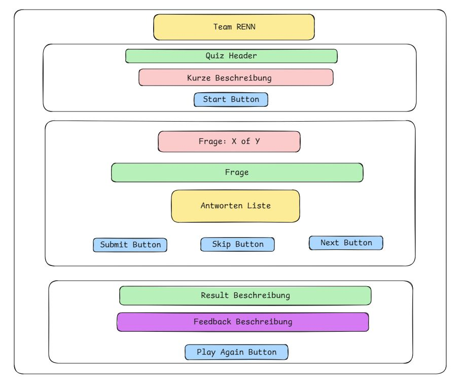

# 💡 JavaScript Genius Quiz  
*Ein interaktives, unterhaltsames Quiz, das dein JavaScript-Wissen testet!*  

## 🏁 Team **RENN** präsentiert:
### _Run. Explore. Nerd. Network._
Ein motiviertes Entwicklerteam mit Leidenschaft für JavaScript, Design und kreative Weblösungen.  

---

## 🎯 Projektbeschreibung  
**JavaScript Genius Quiz** ist eine interaktive Single-Page-Anwendung (SPA), die dein JavaScript-Wissen auf spielerische Weise testet.  
Starte das Quiz, beantworte Multiple-Choice-Fragen, überspringe schwierige Aufgaben und sieh dir am Ende dein Ergebnis an.

---




---

## 🧠 Funktionen
- 💬 Dynamische Fragen mit sofortigem Feedback  
- 🟢 Richtige / ❌ Falsche Antwortmarkierungen  
- 🔁 Neustart- und „Frage überspringen“-Option  
- 📱 Responsives Design für alle Bildschirmgrößen  
- ⚡ Entwickelt als Single Page Application (SPA)

---

## 🛠️ Verwendete Technologien
- **HTML** – Struktur und Aufbau  
- **CSS** – Design und Layout  
- **JavaScript** – Logik und Interaktivität  

---

## 👥 Team **RENN**
| Name | Aufgabe |
|------|----------|
| **Ronak** | Ergebnis & Layout |
| **Emre** | Struktur & Integration |
| **Naima** | Startseite & Design |
| **Nima** | Quiz-Logik |

---

## 🧩 Ursprung des Namens **RENN**
Der Teamname **RENN** entstand aus den **Anfangsbuchstaben unserer Vornamen**:  
> **R**onak • **E**mre • **N**aima • **N**ima  

Dieser Name steht nicht nur für unsere Zusammenarbeit, sondern auch für unseren Teamgeist:  
Wir arbeiten **gemeinsam, schnell und zielorientiert**, genau wie das deutsche Wort **„rennen“**, das *„laufen“ oder „vorwärtskommen“* bedeutet.  

> 💬 *Team RENN – Vier Namen, eine Richtung, ein Ziel.*

---

## 🚀 So funktioniert es
1. Repository klonen  
   ```bash
   git clone https://github.com/okayemre/Interactive-Trivia-Quiz-Team-Project
